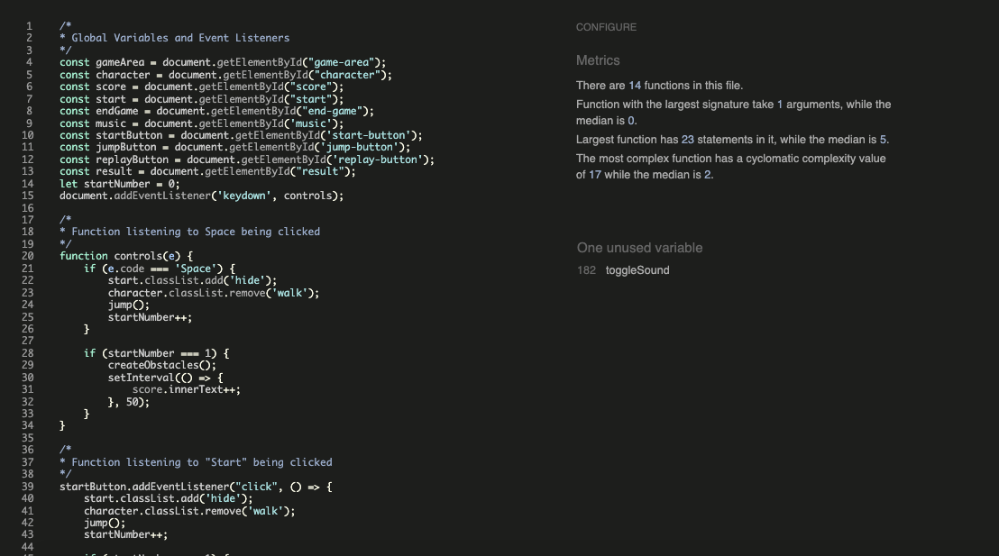
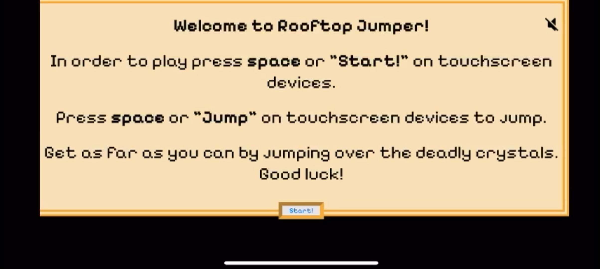
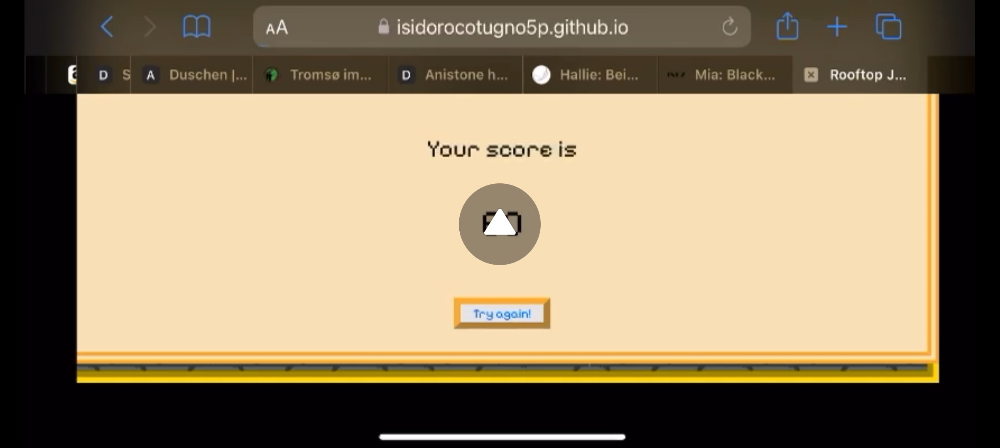
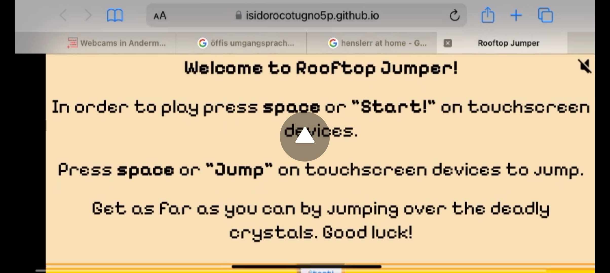
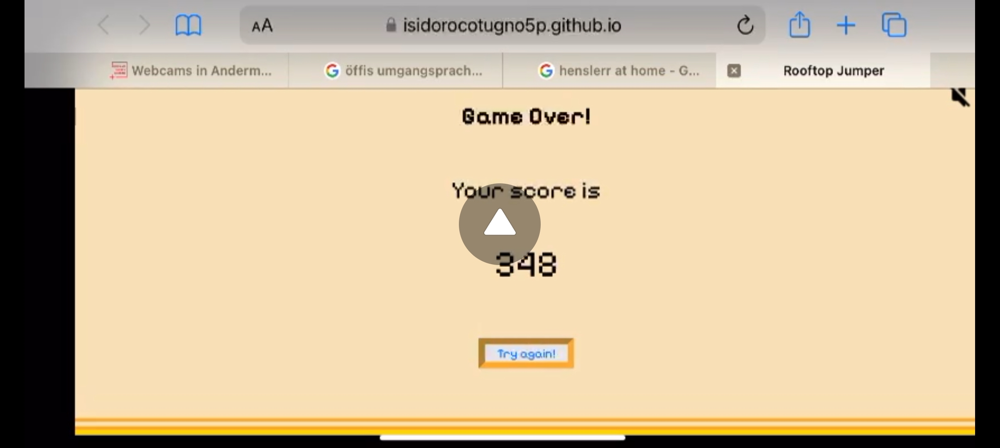
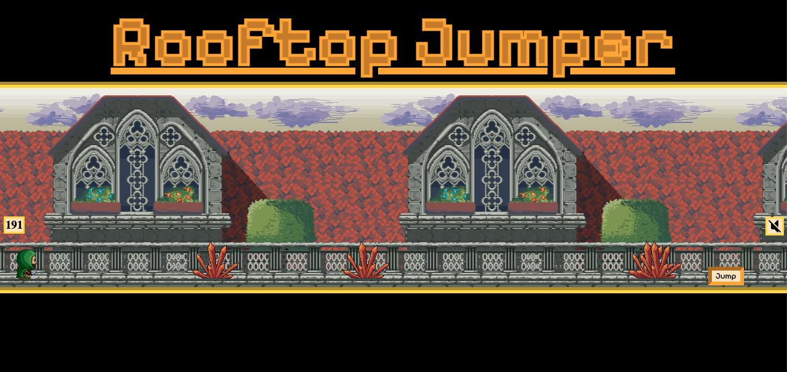

# Rooftop Jumper 2D 8-Bit Style Game 

Welcome to Rooftop Jumper! A 2D 8-Bit style free online videogame using HTML, CSS, and Javascript for an interactive and responsive user experience. I was born in 1995 and had a bigger sister who was very into videogames, this was my inspiration for the game and the motivation to attempt something more complicated and complex than a simple rock, paper, scissors game or something similar. I grew up playing so many different kinds of 2D games, where all you could typically do was move in 4 directions, jump, duck, and maybe even fire off something or use items. Although I would have loved to incorporate all elements and made a fully completed game with an end goal, and even a background story, with my current knowledge I would have not managed that in the alloted time, so I stuck with the most (not-so-simple) simple functions. 

I must admit this was extremely challenging for me, and I have made way more mistakes in this project which resulted in far more bugs and complications than the last project, but the upside is, I learned more than I ever could have if I stuck with something simple. I hope you enjoy playing the game and are able to see the risk associated with something of this level with my current knowledge. I made sure to test extensively and vigorously to find all bugs I possibly pre and post deployment. 

[Link to Live Site](https://isidorocotugno5p.github.io/project2/)

## User Stories 

### 1. User Story 1: Gameplay Mechanics

As a player, I want to be able to control the character’s jump by pressing a single button so that I can avoid obstacles (crystals) while running on the rooftop of the castle and aim for a high score.

- Acceptance Criteria:
  
  * The character should automatically run forward on the rooftop.
  * The player should be able to jump by pressing a single button.
  * The jump must be timed to avoid colliding with crystals, with the character’s height and distance of the jump being appropriate for gameplay.
  * Score should start counter once game starts.

- Key Tasks:

  * Implement the character's automatic forward movement on the rooftop.
  * Develop the single-button mechanic to trigger the jump (e.g., “space” key or by clicking a button).
  * Set jump mechanics to detect crystal collision (i.e., position, height, timing).
  * Implement a visual feedback system for the scoring mechanism.

### 2. User Story 2: Audio Control

As a player, I want to be able to toggle the in-game music on and off by pressing an icon so that I can adjust the game’s audio experience based on my preference.

- Acceptance Criteria:

  * A loudspeaker icon should be displayed on the game interface.
  * The icon should toggle between two states: music on (indicated by a full speaker) and music off (indicated by a muted speaker).
  * The background 8-bit music should be muted upon accessing the website.

- Key Tasks:

  * Design and implement the loudspeaker icon that toggles between two states.
  * Ensure the music does not start automatically when accessing the website for optimal user experience, also if the music is audible that it loops so it consistently plays without interruption.
  * Code the functionality so the icon toggles the music state when clicked.
  * Provide feedback to the player when the music is muted or playing (e.g., change icon appearance).

### 3. User Story 3: Visual Design & Theme

As a player, I want the game to have an engaging, cute medieval theme so that I feel immersed in the rooftop environment while playing.

- Acceptance Criteria:

  * The environment should feature an 8-bit castle rooftop with vibrant medieval-style visuals, such as flags and stone textures.
  * Crystals should be designed as obstacles in an 8-bit style, appearing at random intervals.
  * The character should have a charming, pixelated medieval character design.
  * The character animations should reflect the playful, lighthearted nature of the game.

- Key Tasks:

  * Design and implement a visually appealing 8-bit style rooftop background with a castle theme.
  * Create crystal obstacles in an 8-bit style.
  * Design a pixelated medieval character with simple animations (e.g., running, jumping).    
  * Test visual consistency to ensure all assets work together harmoniously.

### 4. User Story 4: Game Over Screen and Restart Option

As a player, I want to see a clear "Game Over" screen with the option to restart the game, so that I can immediately try again after losing with the final score displayed.

- Acceptance Criteria:

  * When the player collides with a crystal, a "Game Over" screen should appear.
  * The screen should display a "Try Again" button that allows the player to restart the game.
  * The "Game Over" screen should include a simple message such as “Game Over!” with the final score displayed to the user. 

- Key Tasks:

  * Design a "Game Over" screen with the final score displayed.
  * Implement logic to trigger the "Game Over" screen when a collision with a crystal occurs.
  * Add a "Try Again" button that resets the game and starts a new session.
  * Provide feedback to inform the player that the game has ended and they can start over.
  * Ensure the button resets the game to its initial state, including the score and character position.

### 5. User Story 5: Start Screen with Instructions and Game Explanation

As a player, I want to see a start screen with a brief explanation of the game, how to play, and a "Start" button, so that I understand the objective and controls before starting the game.

- Acceptance Criteria:
  
  * The start screen should clearly explain the objective of the game and how to play (e.g., jump over crystals to avoid them).
  * A button labeled "Start Game" should be visible, allowing the player to start the game when ready.
  * The screen should also include a simple set of instructions, such as “Press [Button] to Jump.”
  * The start screen design should match the medieval, cute 8-bit theme of the game.

- Key Tasks:

  * Design a visually appealing start screen that includes a background consistent with the game’s theme.
  * Add a short description of the game, explaining the goal: “Run on the castle rooftops and jump over crystals to get the highest score.”
  * Include a button labeled “Start Game” that starts the gameplay when clicked.
  * Display clear and simple instructions, such as “Press [Button] to Jump” and “Avoid Crystals.”
  * Ensure that the start screen is easily navigable and doesn’t delay the start of the game when the player is ready to begin.

## Features 

This section will include the features of this videogame project and how they effectively aided in achieving all goals. Design is the exact same for mobile as for desktop. The only different is the portrait mode block screen added to devices when orientation is in portrait mode. 

### Start Screen

### Game Screen

### End Screen

### Portrait Mode Block Screen (Touchscreen Devices Only)

### Tab

## Lighthouse Layout

This section is a simulated display of how the game appeared on Google Devs on different screen sizes, proving its reponsiveness and stylistic consistency. Upon reviewing my grade for the last project I came across a problem that became apparent to me while doing this project as well which is that the website is cut off on one end, which was a criticism in the previous review. Now that I am aware that this issue exists, and persists, it will be something that I will be tackling with my mentor as to why that happens when I code and the mistakes I am making to cause that, that I am currently not aware of. 

### IPhone SE

### IPhone 12 Pro

### IPhone 14 Pro Max

### Samsung Galaxy S20 Ultra

### iPad Mini

### iPad Pro

### Surface Duo

### Asus Zenbook Fold

### Nest Hub Max

## Styles

### Fonts

Below you will find a breakdown of the primary font.

#### Primary Font

I chose "Pixelify Sans" because the font is heavily reminiscent of the theme of the game and the vibe I curated around it. It is pure nostalgia, whether you were born in the 80's and 90's and attended arcades, are aware of the culture around old 8bit style games, or can just tell the consistent styling choices by the atmosphere this font creates, artistic throwbacks in any shape or form when carefully put together make people feel nostalgic regardless of whether they have experienced the time or not. 

### Color Schemes

Below you will find a breakdown of each color and its purpose, as well as their contrast score. The color scheme is a lot simpler than my last project, but the colors were still carefully chose to create a comforting experience with warm tones while still retaining a sort of visual lightness and lightheartedness.  

#### Colors Chosen & Purpose

The beige color helps support the overall comforting, cozy, laidback, and non-serious feeling this game conveys while being warm but simultaneously light and not too heavy to due the fact that it literally is a lighter shade.

The gold is there to reinforce the beige but give the entire game a royal touch to emphasize the medieval world the game is set in. It is used as accents to not overwhelm other colors or aspects of the game but still adding some luxuriousness. 

The orange color is there as a highlight color that lives within a similar family to the beige or gold but adds a little different extra. Used as highlights it helps give the color scheme I have created more depth and a little more variety without being too overwhelming or visually inconsistent. 

The black is a classic color for these 8bit games and reinforces the idea of this being a throwback to the Arcades. Most of those games have either white or black colored font writing. It creates a strong contrast to the main colors chosen, making everything legible and accessible while simultaneously retaining the stylistic originality of these old school games. 

#### Contrast Score

This is the actual contrast score. The reason I say actual, is because in the testing phase, when I used WebAim Wave an error occured that was illogical. For a more detailed breakdown see the testing section.

### Wireframes Layout 

Here you can see the layout for landscape touch screen devices and desktop devices as well as laptop screen is exactly the same. My focus was not so much CSS individuality on each screen but I wanted to rather challenge myself by choosing something challenging in regards to Javascript as that was my focus for this project. I chose to do it per hand because it is far more efficient and a lot more personal. Balsamiq is great, but I feel far more comfortable and connected to my project when I do the wireframe by hand. Long term I just need to make sure I have the proper tools to be able to make accurate designs on paper. 

#### Mobile & Desktop

##### Start Page 

##### Game Page

##### End Game Page

### Music

The music for this game was carefully chosen and curated. Trying different types of music, implementing it into the game, and testing it, it was clear that the music that emphasized the 8bit style was going to be the best choice. Having an audible and aural reinforcement of the atmosphere that is created in and around the game makes the game far more submersive and addictive in comparison to having no sound at all. 

## Technologies Used 

### Languages 

1. [HTML](https://whatwg.org/) 

    * Page Markup

2. [CSS](https://www.w3.org/)

    * Styling

3. [Javascript](https://www.oracle.com/developer/javascript/)

    * Functions, interactive and responsive design

### Libraries 

1. [Google Fonts](https://fonts.google.com/)

    * Font Style     

2. [PNGTree](https://www.pngtree.com/)

    * For some design elements

3. [PNGMaker](https://pngmaker.ai/)

    * For tab icon

4. [FlatIcon](https://www.flaticon.com/)

    * For on and off speaker png/icon

4. [Music](https://www.youtube.com/watch?app=desktop&v=qWCLauk9oNo&t=0s)

    * Music for gameplay

### Platforms 

1. [Github](https://github.com/)

    * Storing code remotely and deployment

2. [Gitpod](https://www.gitpod.io/)

    * IDE for project developemnt 

### Other Tools 

1. [W3schools](https://www.w3schools.com/)

    * HTML and CSS educational content

2. [WebAim - Contrast Checker](https://webaim.org/resources/contrastchecker/)

    * Check contrast of website

3. [WebAim - Wave](https://wave.webaim.org/)

    * Test accessibility 

4. [Google Developer - Lighthouse](https://developer.chrome.com/docs/lighthouse)

    * For testing

5. [Google - Pagespeed](https://pagespeed.web.dev/)

    * For testing

6.  [W3C Validation Service](https://validator.w3.org/)

    * For both HTML and CSS validation 

7.  [JSHint](https://jshint.com/)

    * For JS Testing

1. [MDN Web Docs](https://developer.mozilla.org/de/)

    * HTML, CSS, and Javascript educational content

## Credits 

No external code was used to make this game. The game was developed based on lessons learned in the course work as well as self taught functions and material on different educational websites such as W3schools and MDN Web Docs. 

## Testing 

### Lighthouse 

#### Mobile 

##### Desktop

### HTML Validation 

### CSS Validation 

### JSHint Validation 

As you can see there are no issues present in my Javascript code. There is a mention of an unused variable, but that was used as an on-click function in the HTML. I know that these are discouraged, but the reason I chose to use and include this is because I wanted to display as well as test and experiment different possible approaches. Instead of being told what is right and what is wrong, even if I agree or disagree, I think every element should be tested and tried in order to understand why, or why not. 

### WebAim - WAVE

As you can see above we have the WebAim Wave results. The aforementioned contrast issue is clearly visible here as when you click on the contrast section of the three errors that occured, the program is comparing a black font to a black background creating a contrast of 1:1, which very obvsiously is impossible to read for anyone. Luckily as shown above in the actual contrast results, the contrast is closer to 17:1 making it perfectly legible and rendering these errors invalid. 

### General Testing 

Apart from the tests shown above and below, the most difficult aspect of this game was the collision algorithm. I was adamant about doing everything myself and making sure it was 100% original. What I did not know was how difficult it would end being accurately adjusting the collision algorithm to different screen sizes. This part of my code arguably took the longest and the most testing by far. I tried different approaches in the way I calculated and detected the collision, but no matter what I did as soon as I played it on a screen significantly smaller or bigger, the collision detection was completely off. Although I am certain there is a more efficient, more accurate mathematical approach in the end I decided I could calculate the collision based on bootstrap breakpoints and calculate the inner screen width using an external function that would feed the result back into the original calculation, then identify if the collision is valid based on what screen size the game was being played on by using a if else statement.

Developing this aspect of the game although terribly stressful, was also the most fun, and taught me more than anything else so far about functions, but also about coding as a whole. 

Furthermore, I generally tested and tried to get my hands on more devices in my last project. This showed me the variability of issues that possibly could arise post deployment on different devices, with different operating systems, from different years, using different browsers. I learned just as much doing this, as I did when I was actually coding. It helped me understand what can go wrong, why it can go wrong, and how much different the final deployed result can be from a Google Devs simulation. 
 
### Mobile and Tablet Testing

These pictures and descriptions are referring to phones I physically tested. Most pictures were taken during a screen recording. 

Unfortunately I was not able to get my hands on any kind of tablet device, but I think this following logic would also apply to these devices. Since the game was opened on the browser, and not an app, the tabs of the browsers, even if it was just one, got in the way of the screen and minimized the quality of the experience overall. If I was to upgrade the user experience, not really knowing how to do this, I would have wanted to implement a full screen feature, so the game takes up the entire screen and nothing gets in the way.

#### Samsung Galaxy A13 (Personal Phone)

Funnily enough, my phone was one of the only ones that was consistent throughout and where everything went as planned. It played just as well as on the computer and everything was fitted well. Everything function as it was supposed to.

#### Samsung Galaxy A14 

Although this phone is very similar to mine, I came across similar stylistic issues on the IPhones in the following tests. This makes me believe that it is an issue of specific screen sizes with specific values. 

#### IPhone 14 Pro Max 

The gaming performance on this phone were functioning very well overall there were just some stylistic issues and bugs post deployment that have been described in the bugs section of this README file.

#### IPhone 13 Pro

The gaming performance on this phone were functioning well overall, but again there were just some stylistic issues and bugs post deployment that have been described in the bugs section of this README file.

#### IPhone 11

As displayed above, this is the phone (browser was Safari), that gave me the most trouble. The issues were multiple, and in the timeframe I had as well as my level of capability, not possible for me to do. For a more detailed breakdown of the individual bugs, please see the unfixed bugs section.

#### IPhone SE 1st Generation

#### IPhone SE 2nd Generation 

### Desktop Testing 

These pictures and descriptions are referring to desktop devices and laptops I physically tested.

#### Macbook Pro 13 Inch mid 2012 (macOS Catalina)

As one can see above when using my own computer the design and responsiveness in consistent with what I was looking for. This was tested on Google Chrome.

#### Macbook Pro 13 Inch 2017 (macOS Ventura)

As one can see above when using my family computer the design and responsiveness in consistent with what I was looking for. This was tested on Safari.

#### Apple Mac Mini M4 on 50 inch Screen 

## Bugs

This game was incredibly difficult for me to code and it took an incredible amount of trial and error. In this section I would like to depict and display the bugs I successfully fixed but also attempt a deep dive into the bugs I could not or did not have time to fix but encountered through vigorous testing. Although some bugs were left unfixed, the testing taught me so much about how deployed websites present their own problems on different devices even if everything seemed fine in Google Devs. It taught me the importance of testing and that there is almost no such thing as too much testing as long as it has purpose. Trying this game out on different devices with different operating systems spiked my curiousity and showed me that long term testing platforms, designs, and code on as many systems and devices I can get my hands on will be crucial to a quality product. 

### Fixed Bugs 

#### Collision Algorithm

This was easily the hardest part of the project. The mistake I originally made was that I was taking the size of the screen width from the outside instead of the inside if I am not mistaken, and then based the collision point based on the percentage of the width at which it occured. I still do not fully understand why it did not work, but logically I assume that depending on the screen size that percentage point shifts, as the location of the character would shift. 

Instead what I ended up doing was I made an external function that returned a specific string value indicating the different screen sizes and breakpoints, and then calculated by trial and error what each percentage point of collision would be. Although I am extremely happy I somehow made it work, I wish I could have coded something more accurate, especially because it was inefficient to calculate the collision point on each device size as well as sometimes when jumping early and just barely touching the back end of the obstacle after jumping over it, the collision doesnt detect that point meaning the span of my collision algorithm is innacurate. I would love to attempt making another collision algorithm, but try a different and more precise approach. 

#### Jump Animation

I was struggling to somehow combine one animation with another. One being the actual jump and its relative location in regards to the character on the screen, meaning how high and how far. The other was the using the sprite sheet and getting the animation to happen while he was jumping, making him look more alive. 

The issue was that I had two different keyframes that were overlapping each other cause they were included on the same class as different animations. By trial and error I understood that the animation and physical location changes of the animation had to be under the same keyframe and animation class. 

#### Game in Portrait on Touchscreens 

This game is not fun in portrait mode, nor is it truly playable. The only 2D games playable in portrait modes of this style would be something similar to "Doodle Jump", where it goes up and down, but not left to right where obstacles are coming at you from such a short distance. So instead of taking on the almost literal impossible challenge of making the game playable in portrait mode I was wondering if there was a way I could force users to play the game in landscape. That is when I came across the orientation targeting abilities in a media query that bases its assumption whether its a touchscreen in portrait or landscape on a ratio between width and height. 

#### Start and End Screens

It was a timely struggle, not an illogical one, but just a time consuming one, to make the the start upon exiting the start screen, and the game end, the moment the end screen appears so the score appended on the end screen was not changing as the game went on secretely in the background. 

The way I worked around this is that the game only started once the first jump is taken which ended up being of stylistic advantage because many old school games I have seen developed this way that have a start screen sometimes also act the way mine does in the beginning. What I mean by that is that the player jumps when you press space on the start screen to start the game, or when you press "Start", which then triggers the start of the game and the creation of obstacles. This is similar to other old school arcade games that I have seen which have a one or two button gameplay system so internally because of the limited buttons, if one button carries 2 functions, both get executed. 

For the end screen I covered the game with the page, indicating that its game over, and in the background I removed the appended character in the game area so he would stop running into obstacles therefore it would stop updating the score when the next collision happened, because collision with the obstacles themselves was not possible.

### Unfixed Bugs 

#### The IPhone 11 Issues

In the pictures that were displayed in the Mobile Testing section I mentioned that the device that gave me the majority of issues was the IPhone 11. I was not able to understand why this was happening but it was incredibly interesting because it was the only device on which these issues occured. We made sure it had the most recent iOS update and that other similar apps or games were functioning on the device as well as Safari. 

The major issues that persisted, aside from the start text being too large to fit on screen in the beginning (but this was an issue on many small screen devices, although not an issue on the simulator in Google Devs), was that first of all the game was impossibly slow, in fact it was so slow that if you were to attempt to even jump over an obstacle (if you had the patience to wait for it to arrive at the character which took about 40 seconds), you could jump past about 5% of the obstacle, meaning you would always land on top of it no matter what. I would love to show a video, but I am not sure how I could implement that into the README. Second of all, the game produced so many obstacles in a row, that even if one attempted and succeeded in jumping over the first obstacle which was impossible in it of itself, the second obstacle would have impaled you immediately because the space in between obstacles was literally non existent making it impossible to jump inbetween obstacles. 

#### Excessive Obstacle Creation 

Picture above displaying the bug

When playing the game and letting the game continue while being on a different programm, software, or tab on the same browser, the game creates obstacles one after the other in the time you are not on the tab. Once you return, depending on how long you were gone, the game displays 10+ obstacles in a row one over another, not next to each other, but literally layered over one another. 

#### Stylistic Differences on Devices vs Simulator (Google Devs)

This was one of the reasons I learned to understand why testing your deployed code on different devices is so crucial. Although Google Devs indicated that everything should look perfectly, one I tested it on specific devices, at times even the same screen available within the simulator the result displayed was different. This time the issue was that the text on the starting screen was so large that the start button was slightly off grid. Although still pressable and playable on all devices, it was not stylistically appealing, nor user friendly. Although I fixed most of these issues after coming across this, I am still adding this bug to the unfixed bug section because I am obviously unable to test it across enough devices to ensure that this bug is indeed fixed on all devices. 

## Future Features

1. Adding a double jump feature.
2. Adding a feature that detects how long you hold down the spacebar and that influences distance jumped, height jumped, or time jumped.
3. Adding flying obstacles and a ducking feature to create more variety. 
4. Adding in a death sequence sprite sheet for a death animation. 
5. Adding in other obstacles, such as monsters, that you can hit or shoot down with an attack animation.
6. Create a point system that adds points for every monster eliminated. 
7. Add a super sequence after x goal is reached like in Super Mario when he gets the golden mushroom.
8. Make game more challenging as time passes by increasing speed or increasing amount of crystals, monsters, obstacles, produced. 
9. Give the character the ability to move left and right to have more control over positioning.
10. Add a highscore count holder. 
11. Add a name input holder.
12. More consistent placement of score and speaker throughout all different types of devices to not obstruct view/gameplay. 
13. Adding other interactive design elements like clouds drifting by or birds flying by.
14. Adding individual audio effects, like crystal walking, jumping sounds, footstep effects, death sound, wind or field audio to create a more immersive experience. 

## New Applied Functions and Features Learned

### Keyframes and CSS Animations

This was probbaly the most fun aspect to learn because I have a general affinity for animation, and also it is extremely gratifying to borderline bring something to life and anthropomorphise a picture of something, or give it certain characteristics that let it come to life or makes it seem realistic. The challenge of also incorporate Javascript functions that manipulated when he was jumping, and walking, and that each animation sequence was triggered correctly gave me a new perspective on how to target and switch classes on different HTML elements. 

### Integrated Javascript Function

In general functions that already exist within Javascript I find incredibly interesting and useful such as event listeners, or being able to pull something from HTML and targeting it, or changing classes on CSS of HTML elements.

#### .play and .pause

This took a little bit of digging because I could not get my music to play and work in a toggling function for the longest time until I found this article on .play and .pause on W3schools and applied it to my code. 

### Getting width of screen being used to calculate collision point

window.innerWidth when applied in my collision detection algorithm as a external function that returned a value depending on the size of the screen the user is on saved me as I was only able to figure this out a few days before submission. This enabled me, when applied, to correctly return a specific screen size value which was categorized by using bootstrap breakpoints and given different strings (e.g. sm, md, lg, and xl), gave me the ability to individually target the different screen size and adjust the collision point dependent on screen size. 

### setInterval and setTimeout

This came in very useful for my entire game to trigger certain functions and sequences, to let something happen infinitely or after a certain period of time. It gave me more control over the control when creating and destroying obstacles obstacles. 

### clearInterval

Before I came across this function my code was causing the console to shoot out errors repeatedly because the setInterval function that was applied on the obstacle whose job it was to remove the obstacle once off screen was repeating itself upon the already deleted appended Child which made the console return an error message informing me that this Node is not a child of the parent element, because it did not exist anymore. Once I assigned a variable to that interval, and cleared it within the same interval dependent on a certain condition the function cleared itself the moment the condition was met and the console stopped returning error messages. 

### do...while...

This loop came in handy when I could not figure out how to overcrowd the game area with obstacles, and make sure that the random obstacles were not coming out one after the other not giving the user the possibility of having enough space in between obstacles making the game impossible. The loop helped me set a more appropriate range for the number randomization which gave the obstales the necessary space to make the game playable. 

### location.reload()

Although I would have preferred to code a game restart/reset somehow, even though I tried, I was not able to make it happen. So I looked into what I could do in order to reset the game nonetheless giving the user the opportunity to play the game without having to click the reload button themselves, making it appear to be a more seemless user experience. 

### Orientation: Landscape

This was an interesting ability to acquire, since being able to target a specific orientation of touch screen devices can come in incredibly handy for individualising experiences on these devices and also controlling user experience making sure you make them see what you want them to see, and how you want them to see it. 

### fetchPriority 

Attaching this to the script linking my Javascipt to my HTML improved my performance score on lightouse by circa 30 points +/- 2 points depending on whether it was set to mobile or desktop. 

### webkit-text-stroke (width/color)

Learning about this gave my title more depth and a more interesting design.

## Deployment

### Cloning Repository 

1. Go to project repository [here](https://github.com/isidorocotugno5P/project2)
2. Click on the green button labeled "Code" near the top right of the repository
3. Under the "Local" tab under the green button labeled "Code" copy the URL using HTTPS, make sure you are on the "HTTPS" beneath the "Local" tab of the green button labeled "<> Code"
4. You can choose to clone the repository with "SSH" or "GTIHub CLI" beneath the tabs labeled under each respective name
5. To copy each given URL click the copy button next to the URL under each given tab or highlight the URL itself and copy it directly. 
6. Open a terminal on your personal workspace on Github
7. Adapt and change the current working directory to the specific location where you would like your directory cloned
8. Into the terminal type in <code>git clone</code> and paste any of the URL you copied earlier
9. Press enter and your clone will be created

### Fork

1. Follow the previously given link to the given repository of this project
2. On the top right corner of the page you will see a dropdown button link labeled "Fork"
3. Press on it and you should see your own personal Github User ID assuming you have one
4. Click on your User ID to compute the fork
5. Now your browser should redirect you to the forked repository that should have been allocated in your own Github
6. Now if you view the dropdown button on the top right of your own Github organization labeled "Fork" the value should have increased by "1"
7. You have successfuly copied the original repository 

### Local Deployment

1. Once you have successfuly cloned or forked the repository it is time to locally deploy the website
2. Log into your own Github account, assuming that you have completed the previous steps you should have already had an account if you do not have an account please create one [here](https://github.com/). Once completed please follow the steps above for cloning or forking ideally before locally deploying the site.
3. Once you have made a clone or fork of your the linked repository above the repo should appear on the left hand side of your Github dashboard
4. Click on project repository
5. Click on the tabs labelled "Settings" to the right of the tab labelled "Insights"
6. On the left hand side of the Settings tab you will have to naviagte to the section called "Pages"
7. Once you have clicked on Pages you are going to have to set the "Source" to "Deploy from Branch", the "Main Branch", should be selected and the folder location has to be set to "/root"
8. Once all setting are set correctly press save and your website should be properly deployed
9. Return to the tab labelled "Code" on the same level you found the "Setting" tabs earlier, wait a few seconds or minutes, ideally refresh your repository, and your deployed website should be located on the right side of the repository under a section labelled "github-pages"
10. The given link should be an active link to your live website

### Python Webserver Port 

1. If you do not need a local deployment follow these steps in order to achieve a quick overview of the website
2. Once you have forked or cloned the linked repository, in your own github dashboard once you have clicked on the cloned or forked repository click on the green button labelled "Open" which will prompt your Github IDE workstation 
3. In the terminal type in <code>python3 -m http.server</code> to create a port
4. After a few seconds you should receive a pop up on the right of your workstation which will prompt you to make a choice on the deployed port. 
5. To view the current version of the coded website click on the button labelled "Open Browser"
6. This is the current version of the website that has been coded, changed, adapted, or altered on the current repository you have cloned or forked, any saved changed will be adapted on this version of the website before you <code>git push</code> the code and deploy the website