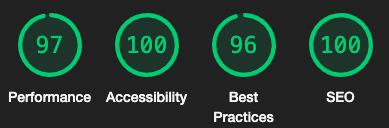
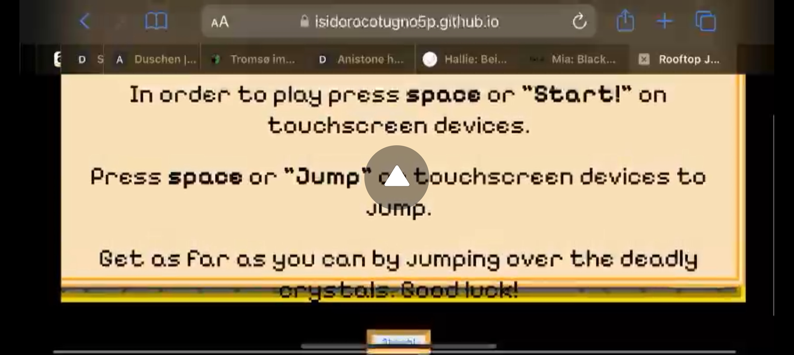
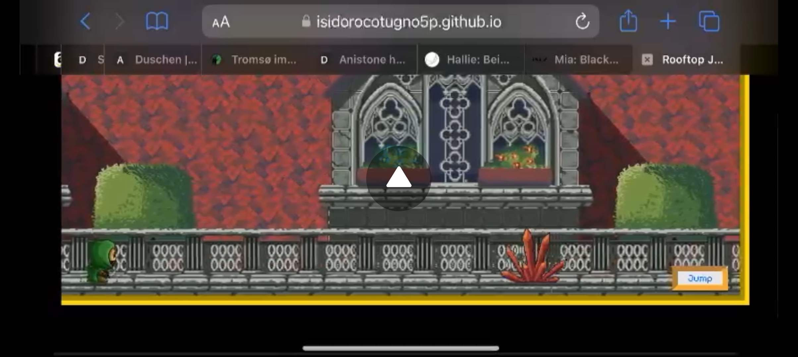
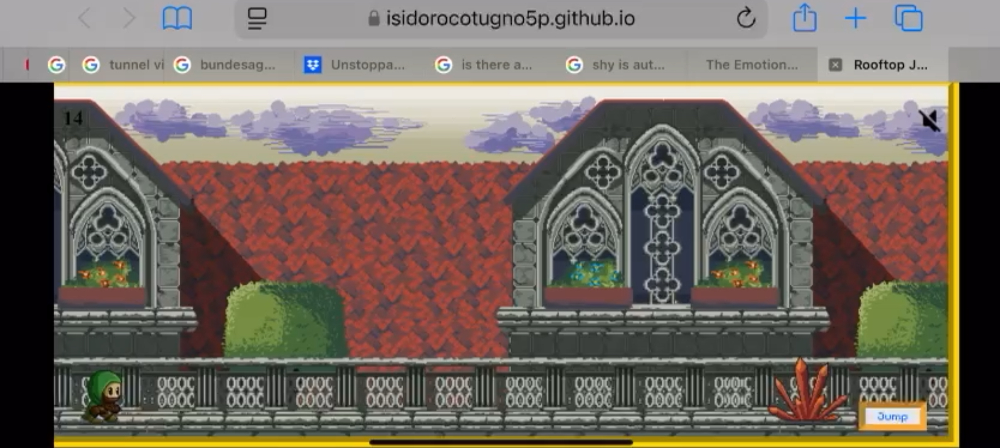

# Rooftop Jumper 2D 8-Bit Style Game 

Welcome to Rooftop Jumper! A 2D 8-Bit style free online videogame using HTML, CSS, and Javascript for an interactive and responsive user experience. I was born in 1995 and had a bigger sister who was very into videogames, this was my inspiration for the game and the motivation to attempt something more complicated and complex than a simple rock, paper, scissors game or something similar. I grew up playing so many different kinds of 2D games, where all you could typically do was move in 4 directions, jump, duck, and maybe even fire off something or use items. Although I would have loved to incorporate all elements and made a fully completed game with an end goal, and even a background story, with my current knowledge I would have not managed that in the alloted time, so I stuck with the most (not-so-simple) simple functions. 

I must admit this was extremely challenging for me, and I have made way more mistakes in this project which resulted in far more bugs and complications than the last project, but the upside is, I learned more than I ever could have if I stuck with something simple. I hope you enjoy playing the game and are able to see the risk associated with something of this level with my current knowledge. I made sure to test extensively and vigorously to find all bugs I possibly pre and post deployment. 

[Link to Live Site](https://isidorocotugno5p.github.io/project2/)

## User Stories 

### 1. User Story 1: Gameplay Mechanics

As a player, I want to be able to control the character’s jump by pressing a single button so that I can avoid obstacles (crystals) while running on the rooftop of the castle and aim for a high score.

- Acceptance Criteria:
  
  * The character should automatically run forward on the rooftop.
  * The player should be able to jump by pressing a single button.
  * The jump must be timed to avoid colliding with crystals, with the character’s height and distance of the jump being appropriate for gameplay.
  * Score should start counter once game starts.

- Key Tasks:

  * Implement the character's automatic forward movement on the rooftop.
  * Develop the single-button mechanic to trigger the jump (e.g., “space” key or by clicking a button).
  * Set jump mechanics to detect crystal collision (i.e., position, height, timing).
  * Implement a visual feedback system for the scoring mechanism.

### 2. User Story 2: Audio Control

As a player, I want to be able to toggle the in-game music on and off by pressing an icon so that I can adjust the game’s audio experience based on my preference.

- Acceptance Criteria:

  * A loudspeaker icon should be displayed on the game interface.
  * The icon should toggle between two states: music on (indicated by a full speaker) and music off (indicated by a muted speaker).
  * The background 8-bit music should be muted upon accessing the website.

- Key Tasks:

  * Design and implement the loudspeaker icon that toggles between two states.
  * Ensure the music does not start automatically when accessing the website for optimal user experience, also if the music is audible that it loops so it consistently plays without interruption.
  * Code the functionality so the icon toggles the music state when clicked.
  * Provide feedback to the player when the music is muted or playing (e.g., change icon appearance).

### 3. User Story 3: Visual Design & Theme

As a player, I want the game to have an engaging, cute medieval theme so that I feel immersed in the rooftop environment while playing.

- Acceptance Criteria:

  * The environment should feature an 8-bit castle rooftop with vibrant medieval-style visuals, such as flags and stone textures.
  * Crystals should be designed as obstacles in an 8-bit style, appearing at random intervals.
  * The character should have a charming, pixelated medieval character design.
  * The character animations should reflect the playful, lighthearted nature of the game.

- Key Tasks:

  * Design and implement a visually appealing 8-bit style rooftop background with a castle theme.
  * Create crystal obstacles in an 8-bit style.
  * Design a pixelated medieval character with simple animations (e.g., running, jumping).    
  * Test visual consistency to ensure all assets work together harmoniously.

### 4. User Story 4: Game Over Screen and Restart Option

As a player, I want to see a clear "Game Over" screen with the option to restart the game, so that I can immediately try again after losing with the final score displayed.

- Acceptance Criteria:

  * When the player collides with a crystal, a "Game Over" screen should appear.
  * The screen should display a "Try Again" button that allows the player to restart the game.
  * The "Game Over" screen should include a simple message such as “Game Over!” with the final score displayed to the user. 

- Key Tasks:

  * Design a "Game Over" screen with the final score displayed.
  * Implement logic to trigger the "Game Over" screen when a collision with a crystal occurs.
  * Add a "Try Again" button that resets the game and starts a new session.
  * Provide feedback to inform the player that the game has ended and they can start over.
  * Ensure the button resets the game to its initial state, including the score and character position.

### 5. User Story 5: Start Screen with Instructions and Game Explanation

As a player, I want to see a start screen with a brief explanation of the game, how to play, and a "Start" button, so that I understand the objective and controls before starting the game.

- Acceptance Criteria:
  
  * The start screen should clearly explain the objective of the game and how to play (e.g., jump over crystals to avoid them).
  * A button labeled "Start Game" should be visible, allowing the player to start the game when ready.
  * The screen should also include a simple set of instructions, such as “Press [Button] to Jump.”
  * The start screen design should match the medieval, cute 8-bit theme of the game.

- Key Tasks:

  * Design a visually appealing start screen that includes a background consistent with the game’s theme.
  * Add a short description of the game, explaining the goal: “Run on the castle rooftops and jump over crystals to get the highest score.”
  * Include a button labeled “Start Game” that starts the gameplay when clicked.
  * Display clear and simple instructions, such as “Press [Button] to Jump” and “Avoid Crystals.”
  * Ensure that the start screen is easily navigable and doesn’t delay the start of the game when the player is ready to begin.

## Features 

This section will include the features of this videogame project and how they effectively aided in achieving all goals. Design is the exact same for mobile as for desktop. The only different is the portrait mode block screen added to devices when orientation is in portrait mode. 

### Start Screen

### Game Screen

### End Screen

### Portrait Mode Block Screen (Touchscreen Devices Only)

### Tab

## Lighthouse Layout

This section is a simulated display of how the game appeared on Google Devs on different screen sizes, proving its reponsiveness and stylistic consistency. Upon reviewing my grade for the last project I came across a problem that became apparent to me while doing this project as well which is that the website is cut off on one end, which was a criticism in the previous review. Now that I am aware that this issue exists, and persists, it will be something that I will be tackling with my mentor as to why that happens when I code and the mistakes I am making to cause that, that I am currently not aware of. 

### IPhone SE

### IPhone 12 Pro

### IPhone 14 Pro Max

### Samsung Galaxy S20 Ultra

### iPad Mini

### iPad Pro

### Surface Duo

### Asus Zenbook Fold

### Nest Hub Max

## Styles

### Fonts

Below you will find a breakdown of the primary font.

#### Primary Font

I chose "Pixelify Sans" because the font is heavily reminiscent of the theme of the game and the vibe I curated around it. It is pure nostalgia, whether you were born in the 80's and 90's and attended arcades, are aware of the culture around old 8bit style games, or can just tell the consistent styling choices by the atmosphere this font creates, artistic throwbacks in any shape or form when carefully put together make people feel nostalgic regardless of whether they have experienced the time or not. 

### Color Schemes

Below you will find a breakdown of each color and its purpose, as well as their contrast score. The color scheme is a lot simpler than my last project, but the colors were still carefully chose to create a comforting experience with warm tones while still retaining a sort of visual lightness and lightheartedness.  

#### Colors Chosen & Purpose

The beige color helps support the overall comforting, cozy, laidback, and non-serious feeling this game conveys while being warm but simultaneously light and not too heavy to due the fact that it literally is a lighter shade.

The gold is there to reinforce the beige but give the entire game a royal touch to emphasize the medieval world the game is set in. It is used as accents to not overwhelm other colors or aspects of the game but still adding some luxuriousness. 

The orange color is there as a highlight color that lives within a similar family to the beige or gold but adds a little different extra. Used as highlights it helps give the color scheme I have created more depth and a little more variety without being too overwhelming or visually inconsistent. 

The black is a classic color for these 8bit games and reinforces the idea of this being a throwback to the Arcades. Most of those games have either white or black colored font writing. It creates a strong contrast to the main colors chosen, making everything legible and accessible while simultaneously retaining the stylistic originality of these old school games. 

#### Contrast Score

This is the actual contrast score. The reason I say actual, is because in the testing phase, when I used WebAim Wave an error occured that was illogical. For a more detailed breakdown see the testing section.

### Wireframes Layout 

Here you can see the layout for landscape touch screen devices and desktop devices as well as laptop screen is exactly the same. My focus was not so much CSS individuality on each screen but I wanted to rather challenge myself by choosing something challenging in regards to Javascript as that was my focus for this project. I chose to do it per hand because it is far more efficient and a lot more personal. Balsamiq is great, but I feel far more comfortable and connected to my project when I do the wireframe by hand. Long term I just need to make sure I have the proper tools to be able to make accurate designs on paper. 

#### Mobile & Desktop

##### Start Page 

##### Game Page

##### End Game Page

### Music

The music for this game was carefully chosen and curated. Trying different types of music, implementing it into the game, and testing it, it was clear that the music that emphasized the 8bit style was going to be the best choice. Having an audible and aural reinforcement of the atmosphere that is created in and around the game makes the game far more submersive and addictive in comparison to having no sound at all. 

## Technologies Used 

### Languages 

1. [HTML](https://whatwg.org/) 

    * Page Markup

2. [CSS](https://www.w3.org/)

    * Styling

3. [Javascript](https://www.oracle.com/developer/javascript/)

    * Functions, interactive and responsive design

### Libraries 

1. [Google Fonts](https://fonts.google.com/)

    * Font Style     

2. [PNGTree](https://www.pngtree.com/)

    * For some design elements

3. [PNGMaker](https://pngmaker.ai/)

    * For tab icon

4. [FlatIcon](https://www.flaticon.com/)

    * For on and off speaker png/icon

4. [Music](https://www.youtube.com/watch?app=desktop&v=qWCLauk9oNo&t=0s)

    * Music for gameplay

### Platforms 

1. [Github](https://github.com/)

    * Storing code remotely and deployment

2. [Gitpod](https://www.gitpod.io/)

    * IDE for project developemnt 

### Other Tools 

1. [W3schools](https://www.w3schools.com/)

    * HTML and CSS educational content

2. [WebAim - Contrast Checker](https://webaim.org/resources/contrastchecker/)

    * Check contrast of website

3. [WebAim - Wave](https://wave.webaim.org/)

    * Test accessibility 

4. [Google Developer - Lighthouse](https://developer.chrome.com/docs/lighthouse)

    * For testing

5. [Google - Pagespeed](https://pagespeed.web.dev/)

    * For testing

6.  [W3C Validation Service](https://validator.w3.org/)

    * For both HTML and CSS validation 

## Credits 

Add credits

## Testing 

### Lighthouse 

#### Mobile 

##### Desktop

### HTML Validation 

### CSS Validation 

### JSHint Validation 

As you can see there are no issues present in my Javascript code. There is a mention of an unused variable, but that was used as an on-click function in the HTML. I know that these are discouraged, but the reason I chose to use and include this is because I wanted to display as well as test and experiment different possible approaches. Instead of being told what is right and what is wrong, even if I agree or disagree, I think every element should be tested and tried in order to understand why, or why not. 

### WebAim - WAVE

As you can see above we have the WebAim Wave results. The aforementioned contrast issue is clearly visible here as when you click on the contrast section of the three errors that occured, the program is comparing a black font to a black background creating a contrast of 1:1, which very obvsiously is impossible to read for anyone. Luckily as shown above in the actual contrast results, the contrast is closer to 17:1 making it perfectly legible and rendering these errors invalid. 

### General Testing 

Apart from the tests shown above and below, the most difficult aspect of this game was the collision algorithm. I was adamant about doing everything myself and making sure it was 100% original. What I did not know was how difficult it would end being accurately adjusting the collision algorithm to different screen sizes. This part of my code arguably took the longest and the most testing by far. I tried different approaches in the way I calculated and detected the collision, but no matter what I did as soon as I played it on a screen significantly smaller or bigger, the collision detection was completely off. Although I am certain there is a more efficient, more accurate mathematical approach in the end I decided I could calculate the collision based on bootstrap breakpoints and calculate the inner screen width using an external function that would feed the result back into the original calculation, then identify if the collision is valid based on what screen size the game was being played on by using a if else statement.

Developing this aspect of the game although terribly stressful, was also the most fun, and taught me more than anything else so far about functions, but also about coding as a whole. 

Furthermore, I generally tested and tried to get my hands on more devices in my last project. This showed me the variability of issues that possibly could arise post deployment on different devices, with different operating systems, from different years, using different browsers. I learned just as much doing this, as I did when I was actually coding. It helped me understand what can go wrong, why it can go wrong, and how much different the final deployed result can be from a Google Devs simulation. 
 
### Mobile Testing

These pictures and descriptions are referring to phones I physically tested. 

#### Samsung Galaxy A13 (Personal Phone)

#### IPhone 14 Pro Max 

The gaming performance on this phone were functioning very well overall there were just some stylistic issues and bugs post deployment that have been described in the bugs section of this README file.

#### IPhone 13 Pro

The gaming performance on this phone were functioning well overall, but again there were just some stylistic issues and bugs post deployment that have been described in the bugs section of this README file.

#### IPhone 11

As displayed above, this is the phone (browser was Safari), that gave me the most trouble. The issues were multiple, and in the timeframe I had as well as my level of capability, not possible for me to do. For a more detailed breakdown of the individual bugs, please see the unfixed bugs section.

#### IPhone SE 1st Generation

#### IPhone SE 2nd Generation 

### Desktop Testing 

These pictures and descriptions are referring to desktop devices and laptops I physically tested. 

## Bugs

This game was incredibly difficult for me to code and it took an incredible amount of trial and error. In this section I would like to depict and display the bugs I successfully fixed but also attempt a deep dive into the bugs I could not or did not have time to fix but encountered through vigorous testing. Although some bugs were left unfixed, the testing taught me so much about how deployed websites present their own problems on different devices even if everything seemed fine in Google Devs. It taught me the importance of testing and that there is almost no such thing as too much testing as long as it has purpose. Trying this game out on different devices with different operating systems spiked my curiousity and showed me that long term testing platforms, designs, and code on as many systems and devices I can get my hands on will be crucial to a quality product. 

### Fixed Bugs 

Add pictures and description

### Unfixed Bugs 

Add pictures and description, add iOS and devices tested with pictures of screen recording and problem description 

## Future Features

1. Adding a double jump feature.
2. Adding a feature that detects how long you hold down the spacebar and that influences distance jumped, height jumped, or time jumped.
3. Adding flying obstacles and a ducking feature to create more variety. 
4. Adding in a death sequence sprite sheet for a death animation. 
5. Adding in other obstacles, such as monsters, that you can hit or shoot down with an attack animation.
6. Create a point system that adds points for every monster eliminated. 
7. Add a super sequence after x goal is reached like in Super Mario when he gets the golden mushroom.
8. Make game more challenging as time passes by increasing speed or increasing amount of crystals, monsters, obstacles, produced. 
9. Give the character the ability to move left and right to have more control over positioning.
10. Add a highscore count holder. 
11. Add a name input holder.
12. More consistent placement of score and speaker throughout all different types of devices to not obstruct view/gameplay. 
13. Adding other interactive design elements like clouds drifting by or birds flying by.
14. Adding individual audio effects, like crystal walking, jumping sounds, footstep effects, death sound, wind or field audio to create a more immersive experience. 

## Deployment

### Cloning Repository 

1. Go to project repository [here](https://github.com/isidorocotugno5P/project2)
2. Click on the green button labeled "Code" near the top right of the repository
3. Under the "Local" tab under the green button labeled "Code" copy the URL using HTTPS, make sure you are on the "HTTPS" beneath the "Local" tab of the green button labeled "<> Code"
4. You can choose to clone the repository with "SSH" or "GTIHub CLI" beneath the tabs labeled under each respective name
5. To copy each given URL click the copy button next to the URL under each given tab or highlight the URL itself and copy it directly. 
6. Open a terminal on your personal workspace on Github
7. Adapt and change the current working directory to the specific location where you would like your directory cloned
8. Into the terminal type in <code>git clone</code> and paste any of the URL you copied earlier
9. Press enter and your clone will be created

### Fork

1. Follow the previously given link to the given repository of this project
2. On the top right corner of the page you will see a dropdown button link labeled "Fork"
3. Press on it and you should see your own personal Github User ID assuming you have one
4. Click on your User ID to compute the fork
5. Now your browser should redirect you to the forked repository that should have been allocated in your own Github
6. Now if you view the dropdown button on the top right of your own Github organization labeled "Fork" the value should have increased by "1"
7. You have successfuly copied the original repository 

### Local Deployment

1. Once you have successfuly cloned or forked the repository it is time to locally deploy the website
2. Log into your own Github account, assuming that you have completed the previous steps you should have already had an account if you do not have an account please create one [here](https://github.com/). Once completed please follow the steps above for cloning or forking ideally before locally deploying the site.
3. Once you have made a clone or fork of your the linked repository above the repo should appear on the left hand side of your Github dashboard
4. Click on project repository
5. Click on the tabs labelled "Settings" to the right of the tab labelled "Insights"
6. On the left hand side of the Settings tab you will have to naviagte to the section called "Pages"
7. Once you have clicked on Pages you are going to have to set the "Source" to "Deploy from Branch", the "Main Branch", should be selected and the folder location has to be set to "/root"
8. Once all setting are set correctly press save and your website should be properly deployed
9. Return to the tab labelled "Code" on the same level you found the "Setting" tabs earlier, wait a few seconds or minutes, ideally refresh your repository, and your deployed website should be located on the right side of the repository under a section labelled "github-pages"
10. The given link should be an active link to your live website

### Python Webserver Port 

1. If you do not need a local deployment follow these steps in order to achieve a quick overview of the website
2. Once you have forked or cloned the linked repository, in your own github dashboard once you have clicked on the cloned or forked repository click on the green button labelled "Open" which will prompt your Github IDE workstation 
3. In the terminal type in <code>python3 -m http.server</code> to create a port
4. After a few seconds you should receive a pop up on the right of your workstation which will prompt you to make a choice on the deployed port. 
5. To view the current version of the coded website click on the button labelled "Open Browser"
6. This is the current version of the website that has been coded, changed, adapted, or altered on the current repository you have cloned or forked, any saved changed will be adapted on this version of the website before you <code>git push</code> the code and deploy the website